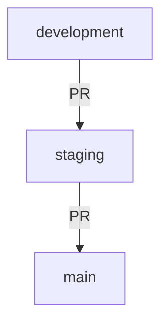
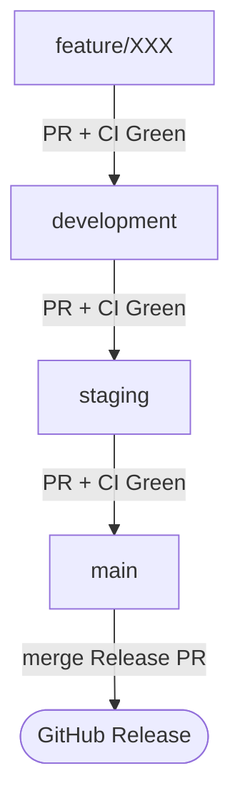

# GitFlow & Release Strategy

## Branch Model



| Branch | Environment | Purpose |
| --- | --- | --- |
| `development` | Development | Active development. All feature branches merge here. |
| `staging` | Staging | Pre-production validation. Code ready for QA / TestFlight. |
| `main` | Production | Production-ready code. Releases are generated here. |

> **Direct pushes to `main` and `staging` are blocked.** All changes go through Pull Requests.

---

## Daily Workflow

### 1. Create a Feature Branch

Always branch from `development`:

```bash
git checkout development
git pull origin development
git checkout -b username/short-description
```

### 2. Work & Commit (Conventional Commits)

Use **Conventional Commits** format so Release Please can auto-generate changelogs:

```bash
# Features
git commit -m "feat(api): add new health endpoint"
git commit -m "feat(mobile): implement count feature"

# Bug fixes
git commit -m "fix(backend): resolve dashboard crash on empty data"
git commit -m "fix(api): correct JWT refresh logic"

# Other
git commit -m "chore(api): update Cloud Run config"
git commit -m "docs(api): add endpoint documentation"
git commit -m "refactor(mobile): extract widget into separate file"
```

**Commit scope** = project name (`api`, `backend`, `mobile`, `cloud-functions`, `pulumi`).
This tells Release Please **which project** the change belongs to.

| Prefix | Version Bump | Example |
| --- | --- | --- |
| `feat` | Minor (0.1.0 → 0.2.0) | New feature |
| `fix` | Patch (0.1.0 → 0.1.1) | Bug fix |
| `feat!` or `BREAKING CHANGE` | Major (0.1.0 → 1.0.0) | Breaking change |
| `chore`, `docs`, `refactor` | No release | Maintenance work |

### 3. Open PR → `development`

```bash
git push origin username/short-description
# Open a PR targeting `development` on GitHub
# Or use the gh CLI :
gh pr create --base [branch] --head [branch] # By default head is the current local branch
gh run list --workflow="deploy-staging.yaml" --limit=1
gh run [ID]
```

- CI tests run automatically.
- After review & approval, merge into `development`.

### 4. Promote to `staging`

When features are ready for QA / TestFlight:

```bash
# Open a PR: development → staging
```

- CI must be green.
- After merge, staging environment can be deployed.

### 5. Promote to `main` (Production Release)

When staging is validated:

```bash
# Open a PR: staging → main
```

- CI must be green.
- After merge, **Release Please** automatically:
  1. Opens a **Release PR** for each project that has changed
  2. Updates the `CHANGELOG.md` in each affected project
  3. Bumps the version in `package.json` / `pubspec.yaml`

### 6. Publish the Release

When a Release PR is merged:

- A **GitHub Release** is created with full release notes
- A **git tag** is created (e.g. `api-v1.0.0`, `mobile-v1.15.0`)
- Only the projects that changed get a release

---

## Per-Project Releases

This monorepo uses **independent versioning**. Each project has its own version:

| Project | Version file | Tag format |
| --- | --- | --- |
| `api` | `api/package.json` | `api-v1.0.0` |
| `front-pharma` | `front-pharma/package.json` | `front-pharma-v1.0.0` |

**Example:** If a PR only changes files in `api/`, only an `api` release is created. `mobile`, `front-pharma`, etc. are unaffected.

---

## Hotfix Process

For urgent production fixes:

```bash
git checkout main
git pull origin main
git checkout -b username/hotfix-critical-fix
# Fix, commit, push
# Open PR → main directly
```

After merge, backport to `staging` and `development`:

```bash
git checkout development
git merge main
git push origin development
```

---

## Revert Process

### Scenario: Buggy Feature on `staging`

You merged a feature branch into `development`, then promoted it to `staging`. After testing, you discover a bug. Here's how to revert:

#### Option A — Revert the Merge Commit on `staging` (Recommended)

This is the safest approach — it creates a **new commit** that undoes the change, preserving full history.

```bash
# 1. Go to staging and find the merge commit to revert
git checkout staging
git pull origin staging
git log --oneline -10
# Look for: "Merge pull request #XX from NoctuaCare/development"

# 2. Revert the merge commit (keep the staging branch baseline, undo the PR)
git revert -m 1 <merge-commit-hash>
# This opens your editor — save the default message

# 3. Push to staging → CI triggers a new deployment that rolls back
git push origin staging
```

> **Why `-m 1`?** When reverting a merge commit, you need to specify which parent to keep. `-m 1` keeps the `staging` baseline and undoes the incoming `development` changes.

#### Option B — Fix Forward

If the bug is small and you can fix it quickly:

```bash
# 1. Create a fix branch from development
git checkout development
git checkout -b username/fix-staging-bug

# 2. Fix the bug, commit with conventional format
git commit -m "fix(api): correct broken validation logic from #XX"

# 3. PR → development → merge
# 4. PR → staging → merge (or direct merge if urgent)
```

This is preferred when the fix is trivial and faster than a revert.

### Scenario: Buggy Feature on `main` (Production)

```bash
git checkout main
git pull origin main
git log --oneline -10
# Find the merge commit

git revert -m 1 <merge-commit-hash>
git push origin main
```

Then **backport** the revert to `staging` and `development`:

```bash
git checkout staging && git merge main && git push origin staging
git checkout development && git merge staging && git push origin development
```

---

## Git Hooks (Local Setup)

The repository includes shared git hooks in `.githooks/` to enforce conventions locally:

| Hook | Purpose |
| --- | --- |
| `commit-msg` | Validates Conventional Commits format (`feat(api): ...`) |
| `pre-commit` | Checks username and branch naming convention |
| `pre-push` | Validates branch naming before pushing |

### New Developer Onboarding

When a new team member joins, follow these steps:

#### 1. Clone the repository

```bash
git clone git@github.com:VentoAureo230/MediLogix.git
cd MediLogix
```

#### 2. Activate the shared git hooks

By default, Git uses `.git/hooks/` (local, not versioned). We use `.githooks/` instead so the hooks are shared across the team:

```bash
git config core.hooksPath .githooks
```

> This command only needs to be run **once** per machine. It persists across pulls and branch switches.

#### 3. Configure your professional identity

```bash
git config user.name "username"
git config user.email "your.name@email.com"
```

#### 4. Verify everything works

```bash
# Test commit-msg hook — this should succeed:
echo 'feat(api): test' > /tmp/test-msg && .githooks/commit-msg /tmp/test-msg

# Test commit-msg hook — this should fail:
echo 'bad message' > /tmp/test-msg && .githooks/commit-msg /tmp/test-msg

# Check your hooks path is set:
git config core.hooksPath
# Expected output: .githooks
```

You're ready to go! 🚀

---

## Summary Diagram


